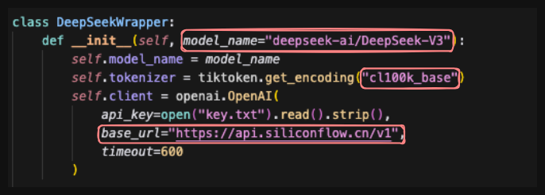

# Usage

To run the code, you need to 
1) create a PDF parsing server and run in the background, 
2) create the LLM feedback server, 
3) open the web browser and upload your paper.

## Create and Run PDF Parsing Server

⚠️⚠️⚠️ **ScienceBeam PDF parser only supports x86 Linux operating system. Please let us know if you find solutions for other operating systems!**

```bash
conda env create -f conda_environment.yml
conda activate ScienceBeam
python -m sciencebeam_parser.service.server --port=6090  # Make sure this is running in the background，don't close it
```

## Create and Run LLM Feedback Server

```bash
conda create -n llm python=3.10
conda activate llm
pip install -r requirements.txt
```
## Replace LLM

Replace YOUR_OPENAI_API_KEY with your OpenAI API key starting with "sk-" in key.txt.   
Change the relevant parameters in the main.py file.



Different models may use different tokenizers. Provided that the model you are using supports this encoding. 

## Change Temporary Folder

If you do not have administrative privileges on the current host, you need to modify the code in the main function.


## Change Prompt
You should modify the prompt to make the output more suitable for your requirements.


## Run main.py

```bash
python main.py  # If you have installed ScienceBeam using x86 Linux and want to generate feedback from the raw PDF file
```

## Open the Web Browser and Upload Your Paper

Open http://0.0.0.0:7799 and upload your paper. The feedback will be generated in around 120 seconds.

You should get the following output:


If you encounter any error, please first check the server log and then open an issue.

